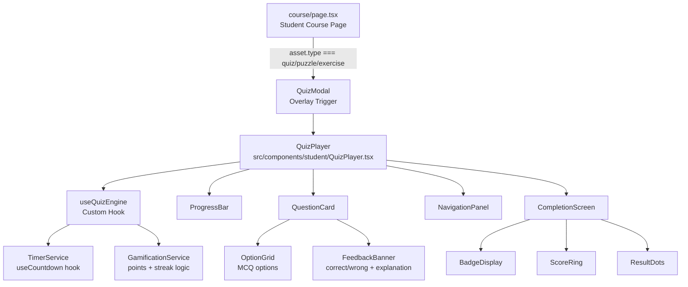
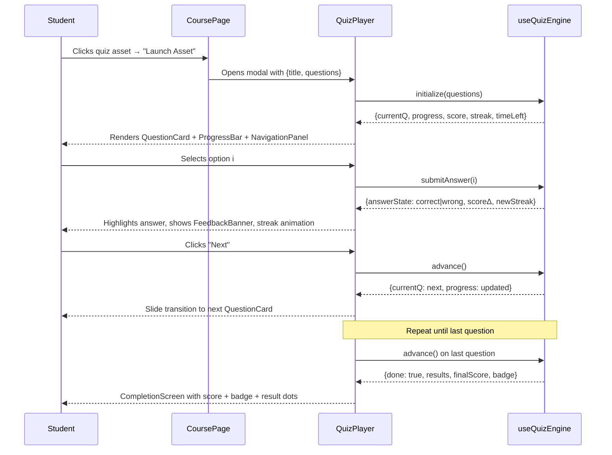
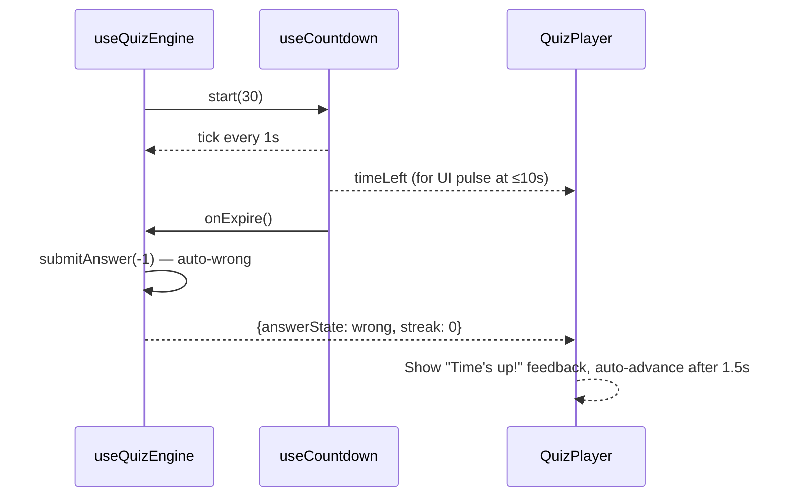

# Design Document: Interactive Quiz System

## Overview

An interactive, gamified quiz system UI for the Ajinora LMS — a Next.js 14 / TypeScript / Tailwind app. The system replaces the current basic `QuizPlayer.tsx` modal with a fully-featured, Duolingo-inspired experience: card-based MCQ layout, animated progress, instant feedback, streak/points gamification, a navigation panel, an optional countdown timer, and a rich completion screen with score + badge. It is triggered modally when a student clicks a quiz/puzzle/exercise asset inside the course page, and integrates cleanly with the existing `module_assets` data model and the admin `QuizBuilder`.

The design covers both the student-facing player (enhanced `QuizPlayer`) and the supporting types/hooks/utilities needed to make it work. No backend schema changes are required — quiz data is already stored as JSON in `module_assets.details`.

---

## Architecture



---

## Sequence Diagrams

### Quiz Launch Flow



### Timer Expiry Flow



---

## Components and Interfaces

### QuizPlayer (enhanced)

**Purpose**: Root modal component. Orchestrates all sub-components and the quiz engine hook.

**Interface**:
```typescript
interface QuizPlayerProps {
  title: string
  questions: QuizQuestion[]
  quizType?: 'quiz' | 'puzzle' | 'exercise'
  timerEnabled?: boolean
  timerSeconds?: number   // default 30
  onClose: () => void
  onComplete?: (result: QuizResult) => void
}
```

**Responsibilities**:
- Render full-screen modal overlay with backdrop blur
- Compose ProgressBar, NavigationPanel, QuestionCard, CompletionScreen
- Delegate all state to `useQuizEngine`
- Handle keyboard shortcuts (Escape → close, 1-4 → select option, Enter → next)

---

### useQuizEngine (custom hook)

**Purpose**: Single source of truth for all quiz state and logic. Keeps QuizPlayer purely presentational.

**Interface**:
```typescript
interface QuizEngineState {
  current: number
  question: QuizQuestion
  selected: number | null
  answerState: 'idle' | 'correct' | 'wrong'
  score: number
  streak: number
  results: boolean[]
  done: boolean
  progress: number          // 0–100
  timeLeft: number
  timerActive: boolean
}

interface QuizEngineActions {
  submitAnswer: (optionIndex: number) => void
  advance: () => void
  jumpTo: (index: number) => void
  restart: () => void
}

function useQuizEngine(
  questions: QuizQuestion[],
  options?: { timerEnabled?: boolean; timerSeconds?: number }
): QuizEngineState & QuizEngineActions
```

---

### ProgressBar

**Purpose**: Animated top bar showing completion percentage.

**Interface**:
```typescript
interface ProgressBarProps {
  progress: number        // 0–100
  streak: number          // drives color shift (normal → amber at streak ≥3)
  questionIndex: number
  totalQuestions: number
}
```

---

### QuestionCard

**Purpose**: Displays the current question text and MCQ option grid with answer state styling.

**Interface**:
```typescript
interface QuestionCardProps {
  question: QuizQuestion
  selected: number | null
  answerState: 'idle' | 'correct' | 'wrong'
  onSelect: (index: number) => void
}
```

---

### FeedbackBanner

**Purpose**: Slides up after answer selection to show correct/wrong + explanation.

**Interface**:
```typescript
interface FeedbackBannerProps {
  answerState: 'correct' | 'wrong'
  explanation?: string
  pointsEarned: number
}
```

---

### NavigationPanel

**Purpose**: Horizontal scrollable row of numbered question buttons showing answered/unanswered/current state.

**Interface**:
```typescript
interface NavigationPanelProps {
  total: number
  current: number
  results: (boolean | null)[]   // null = unanswered
  onJump: (index: number) => void
}
```

---

### CompletionScreen

**Purpose**: Full-screen result view with animated score ring, badge, result dots, and action buttons.

**Interface**:
```typescript
interface CompletionScreenProps {
  score: number
  totalPoints: number
  correctCount: number
  totalQuestions: number
  results: boolean[]
  badge: BadgeLevel
  onRetry: () => void
  onClose: () => void
}

type BadgeLevel = 'gold' | 'silver' | 'bronze' | 'none'
```

---

### StreakBurst

**Purpose**: Floating toast animation when streak ≥ 2. Already exists — will be enhanced with Framer Motion spring.

**Interface**:
```typescript
interface StreakBurstProps {
  streak: number
  bonusPoints: number
}
```

---

## Data Models

### QuizQuestion (existing, extended)

```typescript
type QuizQuestion = {
  id: number
  question: string
  options: string[]
  correct: number           // index of correct option
  explanation?: string
  points?: number           // per-question points (default 100)
}
```

### QuizResult

```typescript
type QuizResult = {
  score: number
  totalPoints: number
  correctCount: number
  totalQuestions: number
  percentage: number
  badge: BadgeLevel
  results: boolean[]
  timeTaken?: number        // seconds
}
```

### QuizConfig (stored in module_assets.details JSON)

```typescript
type QuizConfig = {
  questions: QuizQuestion[]
  totalPoints: number
  timerEnabled?: boolean
  timerSeconds?: number
}
```

**Validation Rules**:
- `questions` must be non-empty array
- Each question must have ≥ 2 options
- `correct` must be a valid index within `options`
- `points` defaults to 100 if omitted
- `timerSeconds` must be between 10 and 300 if provided

### BadgeLevel Derivation

```typescript
// percentage → badge
// ≥ 90%  → 'gold'
// ≥ 70%  → 'silver'
// ≥ 50%  → 'bronze'
// < 50%  → 'none'
```

---

## Algorithmic Pseudocode

### Main Quiz Engine Algorithm

```pascal
ALGORITHM useQuizEngine(questions, options)
INPUT: questions: QuizQuestion[], options: {timerEnabled, timerSeconds}
OUTPUT: QuizEngineState & QuizEngineActions

CONSTANTS:
  POINTS_PER_CORRECT ← 100
  STREAK_BONUS       ← 50
  STREAK_THRESHOLD   ← 2

BEGIN
  // Initialize state
  current      ← 0
  selected     ← null
  answerState  ← "idle"
  score        ← 0
  streak       ← 0
  results      ← []
  done         ← false
  timeLeft     ← options.timerSeconds OR 30
  timerActive  ← options.timerEnabled OR true

  PROCEDURE submitAnswer(optionIndex)
    PRECONDITION: answerState = "idle"
    
    IF optionIndex = -1 THEN
      // Timer expired — treat as wrong
      isCorrect ← false
    ELSE
      isCorrect ← (optionIndex = questions[current].correct)
    END IF
    
    setSelected(optionIndex)
    setTimerActive(false)
    setAnswerState(IF isCorrect THEN "correct" ELSE "wrong")
    setResults(results ++ [isCorrect])
    
    IF isCorrect THEN
      newStreak ← streak + 1
      bonus     ← IF newStreak ≥ STREAK_THRESHOLD THEN STREAK_BONUS ELSE 0
      setScore(score + POINTS_PER_CORRECT + bonus)
      setStreak(newStreak)
      IF newStreak ≥ STREAK_THRESHOLD THEN triggerStreakAnimation(newStreak) END IF
    ELSE
      setStreak(0)
    END IF
    
    POSTCONDITION: answerState ≠ "idle" AND results.length = previous.results.length + 1
  END PROCEDURE

  PROCEDURE advance()
    PRECONDITION: answerState ≠ "idle"
    
    IF current + 1 ≥ questions.length THEN
      setDone(true)
    ELSE
      setCurrent(current + 1)
      setSelected(null)
      setAnswerState("idle")
      setTimeLeft(options.timerSeconds OR 30)
      setTimerActive(options.timerEnabled OR true)
    END IF
    
    POSTCONDITION: IF done THEN results.length = questions.length
                   ELSE current = previous.current + 1 AND answerState = "idle"
  END PROCEDURE

  PROCEDURE jumpTo(index)
    PRECONDITION: 0 ≤ index < questions.length
    // Only allow jumping to already-answered questions or current
    IF index ≤ current THEN
      setCurrent(index)
      setSelected(null)
      setAnswerState("idle")
    END IF
  END PROCEDURE

  PROCEDURE restart()
    setCurrent(0); setSelected(null); setAnswerState("idle")
    setScore(0); setStreak(0); setResults([]); setDone(false)
    setTimeLeft(options.timerSeconds OR 30)
    setTimerActive(options.timerEnabled OR true)
  END PROCEDURE

  RETURN { current, question: questions[current], selected, answerState,
           score, streak, results, done, progress, timeLeft, timerActive,
           submitAnswer, advance, jumpTo, restart }
END
```

**Loop Invariants** (timer tick):
- `timeLeft` decreases by 1 each second while `timerActive = true` AND `answerState = "idle"` AND `done = false`
- When `timeLeft` reaches 0, `submitAnswer(-1)` is called exactly once

---

### Badge Derivation Algorithm

```pascal
ALGORITHM deriveBadge(correctCount, totalQuestions)
INPUT: correctCount: number, totalQuestions: number
OUTPUT: badge: BadgeLevel

BEGIN
  ASSERT totalQuestions > 0
  
  pct ← (correctCount / totalQuestions) * 100
  
  IF pct ≥ 90 THEN RETURN "gold"
  ELSE IF pct ≥ 70 THEN RETURN "silver"
  ELSE IF pct ≥ 50 THEN RETURN "bronze"
  ELSE RETURN "none"
  END IF
END
```

---

### Transition Animation Algorithm

```pascal
ALGORITHM slideToNextQuestion(direction)
INPUT: direction: "forward" | "backward"
OUTPUT: Framer Motion animation applied

BEGIN
  exitX  ← IF direction = "forward" THEN -40 ELSE 40
  enterX ← IF direction = "forward" THEN 40  ELSE -40
  
  // Applied via AnimatePresence + motion.div key={current}
  exit:    { opacity: 0, x: exitX,  scale: 0.97 }
  initial: { opacity: 0, x: enterX, scale: 0.97 }
  animate: { opacity: 1, x: 0,      scale: 1    }
  transition: { duration: 0.25, ease: "easeOut" }
END
```

---

## Key Functions with Formal Specifications

### submitAnswer(optionIndex: number): void

**Preconditions:**
- `answerState === 'idle'` (no double-submission)
- `optionIndex === -1` (timer expiry) OR `0 ≤ optionIndex < question.options.length`

**Postconditions:**
- `answerState` is `'correct'` or `'wrong'` (never `'idle'`)
- `results.length` increased by exactly 1
- If correct: `score` increased by `POINTS_PER_CORRECT + (streak ≥ 2 ? STREAK_BONUS : 0)`
- If wrong: `streak` reset to 0
- `timerActive` is `false`

**Side effects:** Triggers streak animation if `newStreak ≥ 2`

---

### advance(): void

**Preconditions:**
- `answerState !== 'idle'` (must have answered before advancing)

**Postconditions:**
- If `current + 1 >= questions.length`: `done === true`
- Else: `current` incremented by 1, `answerState === 'idle'`, `selected === null`, timer reset

---

### deriveBadge(correctCount, totalQuestions): BadgeLevel

**Preconditions:**
- `totalQuestions > 0`
- `0 ≤ correctCount ≤ totalQuestions`

**Postconditions:**
- Returns exactly one of `'gold' | 'silver' | 'bronze' | 'none'`
- Return value is deterministic for same inputs (pure function)

---

## Example Usage

```typescript
// In course/page.tsx — triggering the quiz modal
{quizAsset && (
  <QuizPlayer
    title={quizAsset.title}
    questions={JSON.parse(quizAsset.details).questions}
    timerEnabled={true}
    timerSeconds={30}
    onClose={() => setQuizAsset(null)}
    onComplete={(result) => {
      console.log(`Completed with ${result.percentage}% — badge: ${result.badge}`)
      setQuizAsset(null)
    }}
  />
)}

// Triggering from asset click
const handleAssetClick = (asset: any) => {
  if (['quiz', 'puzzle', 'exercise'].includes(asset.type)) {
    setQuizAsset(asset)   // opens QuizPlayer modal
  } else {
    setActiveAsset(asset) // existing video/pdf flow
  }
}

// useQuizEngine usage inside QuizPlayer
const engine = useQuizEngine(questions, { timerEnabled: true, timerSeconds: 30 })

// Keyboard shortcut handler
useEffect(() => {
  const handler = (e: KeyboardEvent) => {
    if (e.key === 'Escape') onClose()
    if (engine.answerState === 'idle') {
      const idx = parseInt(e.key) - 1
      if (idx >= 0 && idx < engine.question.options.length) engine.submitAnswer(idx)
    }
    if (e.key === 'Enter' && engine.answerState !== 'idle') engine.advance()
  }
  window.addEventListener('keydown', handler)
  return () => window.removeEventListener('keydown', handler)
}, [engine])
```

---

## Correctness Properties

*A property is a characteristic or behavior that should hold true across all valid executions of a system — essentially, a formal statement about what the system should do. Properties serve as the bridge between human-readable specifications and machine-verifiable correctness guarantees.*

### Property 1: Completion invariant

*For any* quiz of any length, when the quiz reaches `done === true`, `results.length` equals `questions.length` exactly.

**Validates: Requirements 4.2, 6.1**

### Property 2: Score monotonicity

*For any* sequence of answer submissions, `score` is monotonically non-decreasing — it never decreases between submissions.

**Validates: Requirements 2.2, 2.3**

### Property 3: Streak reset on wrong answer

*For any* quiz state with any streak value, submitting a wrong answer always resets `streak` to 0.

**Validates: Requirements 2.4, 5.2**

### Property 4: submitAnswer idempotency guard

*For any* quiz state where `answerState !== 'idle'`, calling `submitAnswer` a second time is a no-op — score, streak, results, and answerState remain unchanged.

**Validates: Requirements 2.5, 8.3**

### Property 5: Badge derivation is a pure function

*For any* pair `(correctCount, totalQuestions)` with `0 ≤ correctCount ≤ totalQuestions` and `totalQuestions > 0`, `deriveBadge` always returns the same `BadgeLevel` and the result is always one of `'gold' | 'silver' | 'bronze' | 'none'`.

**Validates: Requirements 6.3, 6.4, 6.5, 6.6**

### Property 6: jumpTo forward-skip guard

*For any* quiz state, calling `jumpTo(i)` with `i > current` leaves `current`, `answerState`, and `selected` unchanged.

**Validates: Requirements 4.4, 8.4**

### Property 7: Restart round-trip

*For any* quiz state at any point during a session, calling `restart()` produces state identical to the initial state produced by `useQuizEngine(questions, options)` — same `current`, `score`, `streak`, `results`, `done`, `timeLeft`, and `answerState`.

**Validates: Requirements 6.7**

### Property 8: Score arithmetic correctness

*For any* sequence of N correct answers with known streak values, the final `score` equals `N * POINTS_PER_CORRECT + sum(STREAK_BONUS for each answer where newStreak ≥ STREAK_THRESHOLD)` — no phantom points are added or lost.

**Validates: Requirements 2.2, 2.3, 5.1**

### Property 9: Timer auto-submit on expiry

*For any* question where the timer reaches 0 while `answerState === 'idle'`, `answerState` becomes `'wrong'` and `timerActive` becomes `false` — the question is never left in `'idle'` state after timer expiry.

**Validates: Requirements 3.2, 3.1**

---

## Error Handling

### Malformed Quiz Data

**Condition**: `module_assets.details` JSON is missing `questions` or has empty array  
**Response**: QuizPlayer renders an error state card ("This quiz has no questions yet") instead of crashing  
**Recovery**: Student can close the modal; admin can fix via QuizBuilder

### Timer Race Condition

**Condition**: Timer fires `submitAnswer(-1)` at the same tick the student clicks an option  
**Response**: `answerState !== 'idle'` guard in `submitAnswer` prevents double-submission; first caller wins  
**Recovery**: No action needed — state remains consistent

### Zero Questions Edge Case

**Condition**: `questions.length === 0` passed to `useQuizEngine`  
**Response**: Hook returns `done: true` immediately; CompletionScreen shows 0/0 with no badge  
**Recovery**: Graceful empty state, no crash

---

## Testing Strategy

### Unit Testing Approach

Test `useQuizEngine` hook in isolation using React Testing Library's `renderHook`:
- Correct answer increments score by `POINTS_PER_CORRECT`
- Streak bonus applied at streak ≥ 2
- Wrong answer resets streak to 0
- Timer expiry calls `submitAnswer(-1)` and sets `answerState: 'wrong'`
- `advance()` on last question sets `done: true`
- `restart()` resets all state to initial values
- `deriveBadge` returns correct level for boundary values (49%, 50%, 69%, 70%, 89%, 90%)

### Property-Based Testing Approach

**Property Test Library**: fast-check

Key properties to test:
- `score` after N correct answers equals `N * POINTS_PER_CORRECT + streakBonuses` (no phantom points)
- `results.length` always equals number of `submitAnswer` calls made
- `deriveBadge(c, t)` output is always one of the four valid `BadgeLevel` values for any `0 ≤ c ≤ t`
- Calling `submitAnswer` twice on the same question (second call while `answerState !== 'idle'`) is a no-op

### Integration Testing Approach

- Render `QuizPlayer` with mock questions, simulate full quiz flow (select → next → ... → completion screen)
- Verify `onComplete` callback receives correct `QuizResult` shape
- Verify `onClose` fires on Escape key and close button
- Verify navigation panel dots update correctly as questions are answered

---

## Performance Considerations

- `useQuizEngine` uses `useCallback` for all action functions to prevent unnecessary re-renders of child components
- `AnimatePresence` with `mode="wait"` ensures only one question card is in the DOM during transitions
- NavigationPanel uses `useMemo` to derive dot states from `results` array
- Timer uses `setTimeout` (not `setInterval`) to avoid drift and stale closure issues
- Quiz data is parsed from JSON once at modal open, not on every render

---

## Security Considerations

- Correct answer index is embedded in the client-side `QuizQuestion` object (same as current implementation). This is acceptable for in-course learning quizzes where the goal is education, not proctored assessment. Formal exams use the separate `/student/exams` flow with server-side answer validation.
- No PII is transmitted during quiz play — results are local state only (no persistence API call for course quizzes)
- Timer cannot be manipulated to skip questions — `answerState` guard is the authoritative gate, not the timer value

---

## Dependencies

| Dependency | Version | Purpose |
|---|---|---|
| `framer-motion` | already installed | Question slide transitions, streak burst, completion spring animations |
| `lucide-react` | already installed | Icons (Trophy, Zap, Star, Clock, CheckCircle2, XCircle, etc.) |
| `tailwindcss` | already installed | All styling — no new CSS files needed |
| `clsx` + `tailwind-merge` | already installed | `cn()` utility for conditional class merging |

No new dependencies required.
